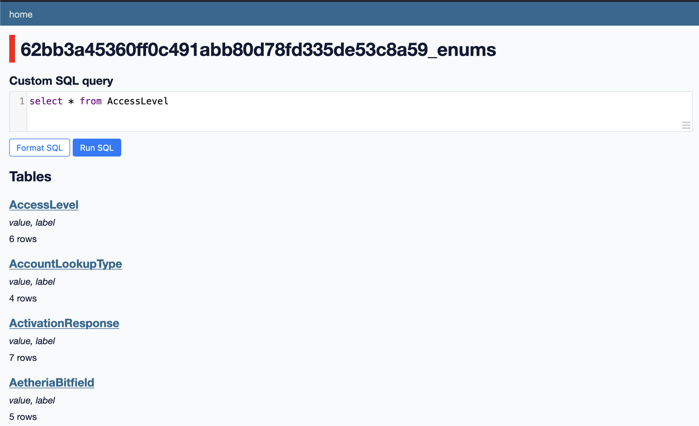
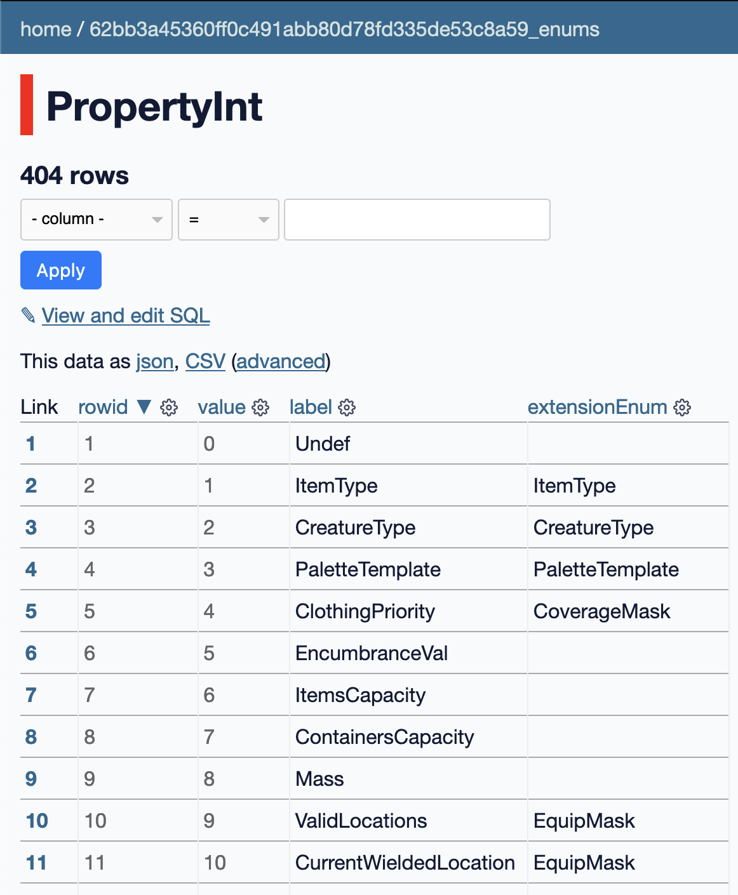
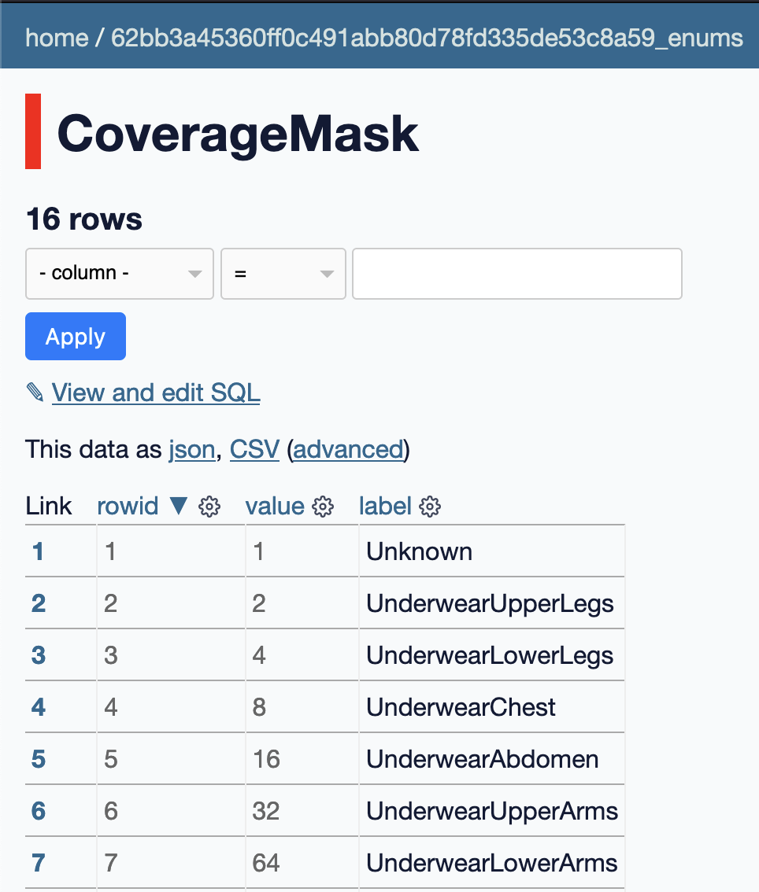

# ace-enum-extractor

This is a small, single-use companion app to
[ACE](https://github.com/ACEmulator/ACE) in service of ACDP. It
extracts all of the enumeration labels and values from the `ACE.Entity.Enum`
namespace along with some of their extensions into a SQLite database.

## Limitations

Currently the list of enumeration extensions (`EnumExtension.cs`)
is hand crafted. If this were to change in ACE, this file would need to be
manually updated.

## Running

You can test `ace-enum-extractor` by running it with the [.NET CLI](https://dotnet.microsoft.com/en-us/download)
(tested with 6.0.405). Provide the path to `ACE.Entity.dll` as the only command line argument.

```sh
dotnet build
dotnet run bin/Debug/net6.0/ACE.Entity.dll
```

The program will produce `enums.db` in the current working directory as output.

## Screenshots of the data

Screenshots from inspecting the database with [Datasette](https://datasette.io/):






