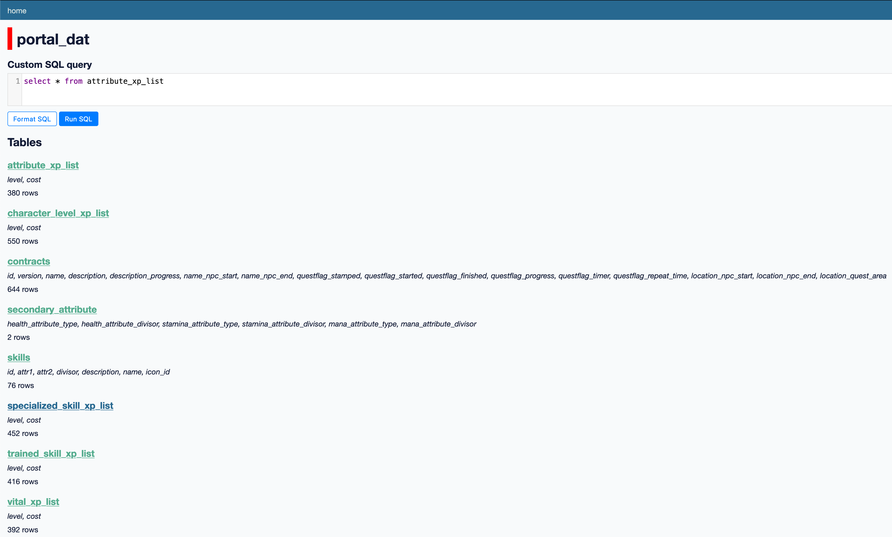
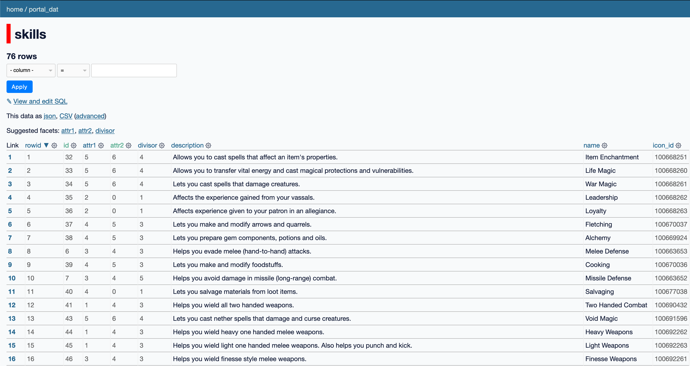
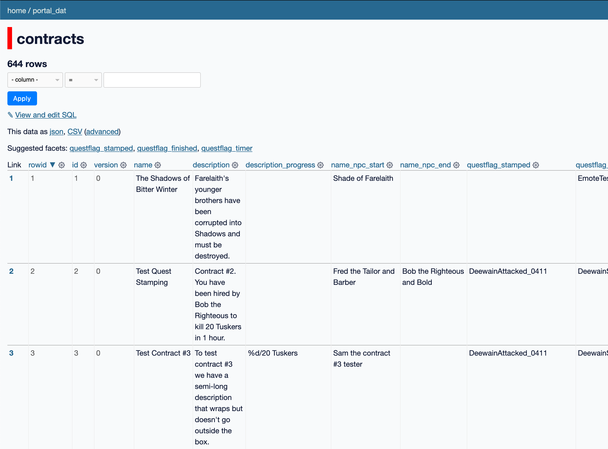

# ace-portal-dat-extractor

This is a small, single-use companion app to [ACE](https://github.com/ACEmulator/ACE)
in service of ACDP. It uses the code in the `ACE.DatLoader` namespace to read
`client_portal.dat` and save some of the tables therein. Currently saved
are the skills table, the XP steps for attributes, trained and specialized
skills, and vitals, the list of contracts, and the formulae for secondary
attributes.

## Running

You can test `ace-portal-dat-extractor` by running it with the [.NET CLI](https://dotnet.microsoft.com/en-us/download)
(tested with 6.0.405). Provide the path to `client_portal.dat` as the only
command line argument.

```sh
dotnet run /path/to/client_portal.dat
```

The program will produce `portal_dat.db` in the current working directory
as output.

## Screenshots of the data

Screenshots from inspecting the database with [Datasette](https://datasette.io/):






